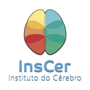

# 2019 Brainhack Global @ Porto Alegre 

This is the website with information for the local Porto Alegre branch of [Brainhack Global 2019](http://www.brainhack.org/global2019/)

## Registration

The cost to participate in Porto Alegre's edition of Brainhack is **R$ 30,00**, instructions to register are available below: 

[Register Here](https://www.eventbrite.com/e/brainhack-global-porto-alegre-2019-tickets-78065113857)

*You have 2 days to pay after your application. Your place on Brainhack will only be confirmed after payment.

## Key Dates

- 20 October: Registration Opens
- 12 November: Registration Closes
- Wednesday - Thursday , 13 - 14 November: Brainhack @ Porto Alegre

## Support

| Site Support  | School Support|
| ------------- |:-------------:|
|          |   |

## Local Schedule

### Wednesday 13th November

- 8:00  - BrainHack Registratin
- 9:00  - BrainHack Opening
- 9:30  - [Welcome to BrainHack](https://github.com/brainhack-poa/brainhack-poa-2019/blob/master/BrainHack2019-Apresentacao.pdf)
- 10:00 - Morning Talk: [Github and Versioning](https://github.com/brainhack-poa/brainhack-poa-2019/blob/master/brainhack-git-2019.pdf)- Felipe Meneguzzi, PhD
- 11:00 - Pytorch Tutorial: Introduction to Deep Learning using Jupyter Notebook - Laura Tomaz
- 12:00 - Lunch
- 14:00 - Pytorch Tutorial: Deep Learning for Neuroimage - Matheus Marcon
- 15:00 - Open Hacking (Projects Definition)
- 17:00 - Adjourn / Tchau

### Thursday 14th November

- 8:00  - Doors Open 
- 8:30  - Morning Talk: Image Preprocessing - Nathalia Esper
- 10:00 - Open Hacking
- 12:00 - Lunch
- 14:00 - [Afternoon Talk: AI in Healthcare](https://github.com/brainhack-poa/brainhack-poa-2019/blob/master/pucrs-ai-healthcare.pdf) - Felipe Meneguzzi, PhD
- 15:00 - Open Hacking
- 17:00 - Final Presentations (15min per group)
- 18:00 - Adjourn / Tchau 

## Location

Brainhack @ Porto Alegre will be held in partnership and at [AGES](http://www.ages.pucrs.br). 

## Local Organisation

Felipe Meneguzzi, PhD

Augusto Buchweitz, PhD

Nathalia Bianchini Esper, MS

Laura Tomaz, MS

Matheus Marcon

## Ideas for Projects
- Multimodal fMRI
- Voxel intensity normalization
- SVM
- CNNs for brain segmentation
